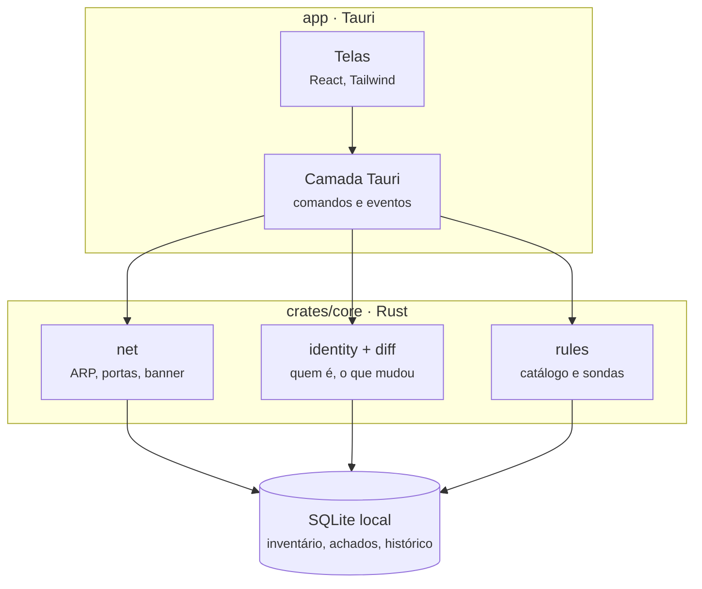
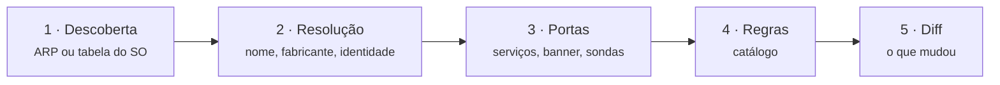

# SentinelStack

Ferramenta de descoberta e auditoria de rede local. Roda inteiramente na máquina do usuário, dentro da rede que audita, e **não se comunica com nenhum serviço externo**.

Responde a três perguntas que quase nenhuma pequena empresa sabe responder:

- O que está conectado na minha rede?
- O que mudou desde ontem?
- O que disso é risco, e o que eu faço a respeito?

---

## O que é e o que não é

**É** um inventário de ativos com detecção de mudança e avaliação de risco. Descobre dispositivos, identifica fabricante e sistema, mapeia serviços expostos, guarda histórico e aponta problemas concretos com instrução de correção em português.

**Não é** um scanner de vulnerabilidade com correlação de CVE, um SIEM, um monitorador de tráfego, nem uma ferramenta de pentest. Nenhuma sonda deste projeto escreve, altera, apaga ou autentica em serviço de terceiro sem consentimento explícito e registrado.

A distinção importa: uma ferramenta que erra ao afirmar "seu Apache é vulnerável ao CVE-XXXX" perde a confiança do usuário de uma vez, e não a recupera. Ver [Por que não há correlação com CVE](#por-que-não-há-correlação-com-cve).

---

## Arquitetura



A regra que governa tudo: **as dependências apontam sempre para baixo**. `crates/core` não conhece Tauri, não conhece React e não sabe que existe interface. Ela recebe configuração e devolve dados por canal.

Isso não é purismo. É o que permite, no dia em que fizer sentido, rodar o núcleo como serviço num container dentro da rede do cliente com interface web, sem reescrever nada. O binário `sentinel` do `crates/cli` já é essa prova: o mesmo motor, sem janela.

### Pipeline da varredura



**A ordem é obrigatória.** A fase 2 precisa vir antes da 3 porque é ela que descobre que `192.168.1.30` é uma impressora HP, e isso muda o ritmo com que a fase 3 pode tocar naquele host. Varrer antes de identificar é como se imprime trinta páginas em branco no financeiro do cliente.

As fases 4 e 5 rodam numa transação única do SQLite, e o evento `scan:finished` só é emitido depois do commit. Se sair antes, a interface lê estado pela metade e pisca.

---

## Requisitos

| | Versão | Notas |
|---|---|---|
| Rust | 1.75+ | `rustup default stable` |
| Node | 20+ | para o frontend e o CLI do Tauri |
| SQLite | — | embutido via `rusqlite` com a feature `bundled` |

**Linux** — dependências do WebKitGTK e do libpcap:

```bash
sudo apt install libwebkit2gtk-4.1-dev build-essential curl wget file \
  libxdo-dev libssl-dev libayatana-appindicator3-dev librsvg2-dev libpcap-dev
```

**Windows** — três coisas, e a terceira é a que trava todo mundo:

1. [Npcap](https://npcap.com) (o instalador normal) — é o driver em tempo de execução.
2. WebView2 Runtime — já presente no Windows 11 e no Windows 10 recente.
3. **Npcap SDK** — o `pnet` linka contra `Packet.lib` e `wpcap.lib`, que **não**
   vêm no instalador do Npcap. Sem o SDK o build morre com
   `LNK1181: cannot open input file 'Packet.lib'`.

Baixe o `npcap-sdk-x.xx.zip` em https://npcap.com/#download, extraia em
algum lugar estável e aponte a variável `LIB` para a pasta `Lib/x64`:

```powershell
# Permanente, para o usuário atual
[Environment]::SetEnvironmentVariable(
  "LIB",
  "C:\npcap-sdk\Lib\x64;" + [Environment]::GetEnvironmentVariable("LIB", "User"),
  "User")
```

Feche e reabra o terminal depois disso, ou o VSCode não vê a variável nova.

**Sem o SDK, dá para trabalhar assim:**

```powershell
cargo test --workspace --no-default-features
```

A feature `raw-socket` é opcional justamente por isso. Repare que os crates
consumidores declaram `default-features = false` na dependência da core: sem
isso o Cargo unifica as features, reativa o `pnet` e o link falha de novo
mesmo com a flag na linha de comando. Sem ela o `pnet` não é
compilado, os testes rodam em qualquer máquina, e o aplicativo abre em modo
limitado (descoberta por TCP e tabela do sistema, sem ARP ativo).

**macOS** — Xcode Command Line Tools.

---

## Começando

```bash
git clone <repo> sentinelstack && cd sentinelstack

# Motor: testes primeiro, sem tocar em rede nenhuma.
cargo test --workspace

# Interface.
cd app && npm install && npm run app:dev
```

### Fontes

O `src/index.css` espera as fontes em `app/src/assets/fonts/`:

- [Inter](https://rsms.me/inter/) → `Inter-Variable.woff2`
- [JetBrains Mono](https://www.jetbrains.com/lp/mono/) → `JetBrainsMono-Variable.woff2`

Locais, não CDN. O produto promete não falar com serviço externo, e promessa desse tipo precisa valer de verdade.

### Base OUI

O `crates/core/src/net/oui.rs` vem com nove fabricantes de exemplo. Para a base completa:

```bash
curl -o /tmp/oui.csv https://standards-oui.ieee.org/oui/oui.csv
# converta para TSV no formato OUI<TAB>Fabricante em crates/core/data/oui.tsv
# e troque o SEED por include_str!("../../data/oui.tsv")
```

Cerca de 35 mil linhas, menos de 1 MB. Vai embutida no binário.

---

## Permissões

O aplicativo funciona em dois modos, e a interface mostra em qual está.

| Capacidade | Sem privilégio | Com privilégio |
|---|---|---|
| Varredura de portas TCP | sim | sim |
| Latência, DNS, HTTP | sim | sim |
| Tabela de vizinhança do SO | sim | sim |
| **Varredura ARP ativa** | não | sim |
| **Escuta passiva de broadcast** | não | sim |

### Liberando o modo completo

```bash
# Linux — no binário, não no usuário.
sudo setcap cap_net_raw,cap_net_admin+eip target/release/sentinel
```

O `.deb` e o `.rpm` fazem isso pelo `postinst.sh`. **AppImage não preserva capabilities**, e é por isso que ele não está nos alvos de bundle: o app abriria sempre em modo limitado.

### O modo sem privilégio usa um truque

Quando o sistema operacional tenta abrir uma conexão TCP para um IP da rede local, ele precisa do MAC e faz o ARP sozinho. O motor dispara conexões em toda a faixa, espera, e lê o cache ARP do sistema. Conexão recusada serve igual, porque o ARP já aconteceu antes do RST chegar.

Resultado: descoberta com MAC sem `CAP_NET_RAW` e sem Npcap. Encontra menos que o ARP direto, mas funciona.

---

## Uso pelo terminal

O CLI existe para o desenvolvimento. Rodar varredura dezenas de vezes por dia abrindo janela e clicando é tortura.

```bash
export SENTINEL_DB=./sentinel.db

sentinel caps enp3s0                     # o que dá para fazer com o privilégio atual
sentinel scan 192.168.1.0/24 enp3s0      # varre e persiste, JSON por linha
sentinel devices                         # inventário atual
sentinel changes                         # mudanças não vistas
```

A saída é um JSON por linha, fácil de inspecionar com `jq` e de comparar entre execuções:

```bash
sentinel scan 192.168.1.0/24 | jq -r 'select(.type=="device") | .device.ip'
```

`Ctrl+C` marca cancelamento. A varredura encerra na fase atual e o diff roda com `complete = false`, então nada é marcado como ausente nem resolvido indevidamente.

---

## Estrutura

```
sentinelstack/
├── Cargo.toml                      workspace
├── rust-toolchain.toml
│
├── crates/
│   ├── core/                       o motor · não conhece interface
│   │   ├── rules.toml              catálogo de 48 regras, embutido no binário
│   │   ├── migrations/
│   │   │   └── 0001_initial.sql    schema, aplicado por PRAGMA user_version
│   │   ├── tests/
│   │   │   └── pipeline.rs         integração ponta a ponta, sem rede
│   │   └── src/
│   │       ├── lib.rs
│   │       ├── model.rs            tipos compartilhados, normalização de MAC
│   │       ├── store.rs            conexão, pragmas, migrações, expurgo
│   │       ├── identity.rs         o matcher · IP e MAC não são chave
│   │       ├── diff.rs             dispositivo novo, ausente, retornado
│   │       ├── service_diff.rs     porta que abriu, porta que fechou
│   │       ├── scan.rs             orquestração das cinco fases
│   │       ├── net/
│   │       │   ├── discover.rs     ARP ativo e fallback pela tabela do SO
│   │       │   ├── ports.rs        perfis, ritmo por dispositivo, política de escrita
│   │       │   ├── banner.rs       coleta respeitando a política
│   │       │   ├── oui.rs          fabricante e palpite de tipo
│   │       │   └── resolve.rs      DNS reverso
│   │       └── rules/
│   │           ├── mod.rs          catálogo, validação, modificadores
│   │           ├── eval.rs         avaliador e ciclo de vida do achado
│   │           └── probes.rs       sondas ativas
│   └── cli/
│       └── src/main.rs             binário `sentinel`
│
└── app/                            a interface
    ├── package.json
    ├── vite.config.ts
    ├── tailwind.config.js          tokens de cor e tipografia
    ├── index.html
    ├── src/
    │   ├── main.jsx
    │   ├── index.css               fontes locais, tema escuro
    │   ├── App.jsx                 as sete telas
    │   └── lib/
    │       ├── api.ts              ponte tipada · nada de invoke direto
    │       └── useSentinel.ts      estado, eventos, buffer de renderização
    └── src-tauri/
        ├── tauri.conf.json
        ├── capabilities/default.json    permissões mínimas
        ├── scripts/postinst.sh          setcap na instalação
        └── src/
            ├── main.rs
            └── lib.rs              comandos e ponte de eventos
```

---

## Modelo de dados

A decisão que sustenta tudo: **IP e MAC não são chave primária de dispositivo**.

O IP muda por DHCP. O MAC não é único por dispositivo (Wi-Fi e cabo na mesma máquina) e celular e notebook modernos usam MAC randomizado por rede. Quem usa um dos dois como identidade termina com inventário duplicado em duas semanas.

A solução separa observação de identidade:

- `device` tem UUID próprio que **nunca** muda
- `device_address` guarda N endereços por dispositivo, com marca de qual é o atual
- Um índice único parcial (`WHERE is_current = 1`) garante no banco que um IP só pertence a um dispositivo por vez, mesmo tendo pertencido a vários ao longo do tempo

O matcher em `identity.rs` aplica a heurística em ordem de prioridade, e decisão manual do usuário (`label_pinned`, `kind_source = 'manual'`) nunca é sobrescrita por heurística.

### O padrão do escopo

O mesmo cuidado aparece em três níveis, e nos três ele impede a mesma classe de bug:

| Módulo | Escopo | O que ele impede |
|---|---|---|
| `diff.rs` | faixa varrida, varredura completa | varredura parcial marcando dispositivos como ausentes |
| `service_diff.rs` | portas varridas naquele host | perfil rápido fechando 143 portas que continuam abertas |
| `rules/eval.rs` | `EvalCoverage` | achado resolvido indevidamente, ressuscitando na varredura seguinte |

Resumindo: **"não olhei" nunca pode ser confundido com "não tem problema"**. Uma sonda que falhou por timeout não entra em `probes_run`.

---

## Catálogo de regras

48 regras em `crates/core/rules.toml`, agrupadas em oito categorias. Cada regra carrega:

- `base_severity` e `confidence` **separados** — são coisas diferentes. "Porta 3306 aberta" é severidade alta com confiança média, porque pode haver firewall de host. "Redis respondeu `+PONG` sem senha" é crítica com confiança confirmada.
- `why` e `fix` **obrigatórios**, em português, escritos para quem vai resolver. Se não dá para escrever os dois em poucas linhas, a regra não deveria existir. Validado na inicialização, não em produção.
- Modificadores de contexto: RDP no gateway e RDP no desktop da contabilidade são coisas diferentes usando a mesma regra.

Metade do catálogo é declarativa (porta, regex em banner, fabricante) e resolve no próprio TOML. A outra metade aponta para sondas em `probes.rs`.

### Severidade efetiva

```
severity_effective = base ± modificadores
```

| Condição | Delta |
|---|---|
| Endereço público (fora da RFC 1918) | +2 |
| Roteador ou firewall | +1 |
| Servidor | +1 |
| Estação, e a regra é de categoria Windows | −1 |
| VLAN de gerência | −1 |
| Risco aceito pelo usuário | −2 |

### Por que não há correlação com CVE

Distribuições Linux fazem backport de correção de segurança **sem alterar o número da versão**. O Apache 2.4.29 do Ubuntu 18.04 recebeu anos de patch continuando a se chamar 2.4.29.

Uma ferramenta que anuncia "Apache 2.4.29, vulnerável ao CVE-2021-41773" está errada na maioria dos casos. No dia em que o cliente descobre isso, ele para de confiar em tudo o que a ferramenta diz.

O que este projeto afirma é o **fim de vida do produto inteiro**, que é fato de calendário e independe de patch. A tabela `[eol]` do `rules.toml` guarda as datas. Correlação com CVE fica para o futuro, com feed de verdade e validação.

---

## Garantias de segurança

Esta seção não é opcional. Uma ferramenta que varre rede alheia precisa ser conservadora por construção, não por convenção.

### Portas que nunca recebem escrita

A porta 9100 é JetDirect: **qualquer byte enviado para ela é interpretado como trabalho de impressão**. Uma requisição HTTP mandada para lá sai impressa em papel. A 515 (LPD) e a 631 (IPP) têm o mesmo problema, e as portas industriais (Modbus 502, S7 102, IPMI 623, DNP3 20000, EtherNet/IP 44818) são pior que isso.

A política é um tipo em Rust, não uma lista de exceções:

```rust
pub enum BannerPolicy {
    ServerSpeaksFirst,          // só ler
    ClientMustSpeak(&'static str),
    TlsHandshake,
    NeverWrite,                 // abrir, confirmar, fechar
}
```

Porta desconhecida cai em `NeverWrite` **por padrão**. Adicionar uma porta nova ao perfil obriga a decidir a política dela; esquecer resulta em silêncio, não em papel impresso. Há teste unitário cobrindo cada porta de impressão e cada porta industrial.

### Ritmo por dispositivo

Impressora e equipamento industrial antigo travam com varredura agressiva. Não é lenda, é rotina.

Dois limites independentes: o global (256 conexões) protege a rede e a tabela de conexões do sistema operacional; o **por host** protege cada equipamento. Um semáforo global generoso pode jogar 256 conexões simultâneas na mesma impressora e derrubá-la.

| Tipo | Concorrência | Espera entre tentativas |
|---|---|---|
| Impressora, câmera, IoT, fabricante industrial | 1 | 120 ms |
| Desconhecido | 4 | 50 ms |
| Roteador, switch, firewall, AP | 8 | 20 ms |
| Servidor, storage, estação | 32 | — |

Fabricante frágil vence a classificação de tipo: um host classificado como servidor mas com MAC da Siemens recebe tratamento de equipamento industrial.

Também: TCP connect, não SYN. Mais lento e mais visível no log do cliente, mas não deixa conexão meio aberta em pilha TCP antiga, que é o que derruba embarcado.

### Sondas confirmam sem alterar

`PING` no Redis, `version` no Memcached, `GET /` no Elasticsearch, negociação de protocolo no SMB — antes de qualquer autenticação. Nenhuma escreve, cria, apaga ou autentica.

É o que separa isso de um scanner de ataque, e é o que permite severidade crítica com confiança confirmada.

### Teste de credencial nasce desligado

As regras `CRED-*` tentam autenticar, e por isso vêm com `enabled = false` e `requires_explicit_consent = true`. Sem uma linha em `credential_consent` para aquele dispositivo, o motor **nem considera** a regra.

Três motivos, escritos no próprio `rules.toml`:

1. Tentativa de login pode bloquear conta em sistema com política de lockout. Derrubar o administrador do domínio no meio da tarde não é jeito de estrear a ferramenta.
2. Gera evento de falha de autenticação, poluindo a trilha de auditoria que o cliente pode precisar depois.
3. Sem autorização por escrito, testar credencial em equipamento de terceiro é problema jurídico.

### Exclusões e auditoria

A lista de exclusão é aplicada na camada mais baixa do motor, como closure, não na interface. Se fosse checada só na tela, um dia alguém chama a função direto.

Toda varredura é registrada em `audit_log`: o que, quando, por quem. Mesmo sendo ferramenta local, vocês vão querer isso no dia em que alguém perguntar por que a impressora do financeiro imprimiu trinta páginas em branco.

---

## Aviso legal e ético

Varrer rede exige autorização. Use este software **apenas** em rede própria ou com autorização formal por escrito do responsável, delimitando as faixas permitidas.

Varredura ativa pode causar instabilidade em equipamento antigo, industrial ou médico. Configure as exclusões **antes** da primeira execução. O perfil seguro é o padrão, mas nenhum perfil elimina o risco por completo.

Os autores não se responsabilizam por uso indevido ou por indisponibilidade decorrente do uso.

---

## Testes

```bash
cargo test --workspace                        # tudo
cargo test -p sentinel-core identity          # só o matcher
cargo test --test pipeline                    # integração ponta a ponta
cargo test --no-default-features              # sem raw-socket, como no CI
```

Cerca de 50 testes, e a maioria cobre exatamente os casos que quebram ferramenta desse tipo em produção, não caminho felizes:

- DHCP trocando o IP de um dispositivo com MAC conhecido
- MAC randomizado não casando por MAC, casando por hostname
- IP reaproveitado migrando de dispositivo sem violar constraint
- Varredura incompleta não marcando ninguém como ausente
- Ausência alertando só ao cruzar o limite, e nunca depois
- Porta que reabre reusando a linha em vez de duplicar
- Varredura rápida não resolvendo achado que não pôde avaliar
- Aceitação de risco sobrevivendo ao achado reaparecer
- Toda porta de impressão e industrial em `NeverWrite`

A feature `raw-socket` é opcional justamente para o CI rodar sem libpcap.

---

## Decisões de arquitetura

| Decisão | Motivo |
|---|---|
| Núcleo em Rust, isolado da interface | mesmo código serve para desktop, CLI e, no futuro, serviço |
| Tauri em vez de Electron | binário de poucos MB, consumo baixo, e o backend já é onde o trabalho de rede precisa acontecer |
| SQLite com `STRICT` | o SQLite aceita texto em coluna INTEGER sem reclamar; `STRICT` rejeita |
| Conexão nova por comando no Tauri | `Connection` não é `Sync`; uma conexão em `Mutex` faria a varredura travar a tela por 60 s |
| Um evento por dispositivo descoberto | lista que enche na tela em vez de spinner por um minuto |
| Buffer de 120 ms no frontend | 254 eventos em segundos; `setState` em cada um trava a interface |
| Migrações por `PRAGMA user_version` | menos auditável com framework do que com três arquivos SQL |
| Regras em TOML embutido | editar regra sem recompilar interface, e sem rede |
| `probe_sample` com `WITHOUT ROWID` | 86 mil linhas por dia por alvo; corta quase metade do disco |

---

## Roteiro

**Feito** — descoberta ARP e sem privilégio, identidade persistente, inventário com histórico, varredura de portas com banner, 48 regras com `why` e `fix`, detecção de mudança em três níveis, sete telas, CLI.

**Próximo** — sondas TLS (exigem verificador permissivo: o objetivo é justamente inspecionar certificado inválido, e um verificador padrão aborta o handshake antes de a ferramenta ver o problema); sondas de latência, perda e jitter; escuta passiva contínua; SNMP para tabela ARP do roteador e contadores de interface; detecção de IP duplicado e DHCP não autorizado; ações nomeadas de diagnóstico; relatório em PDF.

**Depois** — mapa de rede visual, temas, múltiplas VLANs, modo serviço.

### O que está fora de escopo por decisão

Captura de pacote (exige porta espelhada que a maioria das PMEs não tem, gera volume impossível de guardar, e 90% do tráfego é TLS), correlação com CVE por banner, e qualquer ação que modifique o ambiente do cliente.

---

## Convenções de código

- Comentário explica **por quê**, não o quê. Se o código precisa de comentário para dizer o que faz, reescreva o código.
- Todo tipo que cruza a fronteira Rust/TypeScript deveria ser gerado com `ts-rs` ou `specta`. Escrever à mão em `api.ts` é dívida: todo campo novo vira bug silencioso no frontend.
- Nenhum componente chama `invoke` direto. Tudo passa por `api.ts`.
- Nunca edite uma migração já aplicada. Crie a próxima.
- Regra nova no catálogo precisa de `why`, `fix` e teste.

---

## Licença

Defina antes da primeira distribuição. Se o projeto for comercial e fechado, confira a licença de toda dependência de rede: algumas restringem redistribuição em produto proprietário.
